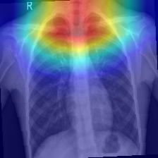
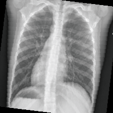
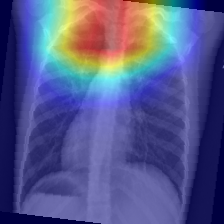
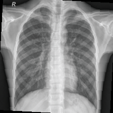
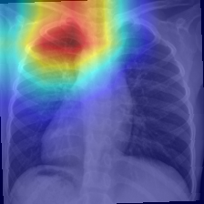
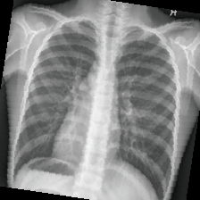
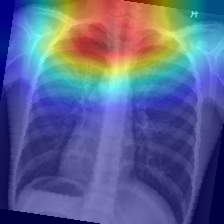

Pneumonia X-ray Classification with Grad-CAM 
This project performs pneumonia classification using chest X-ray images. A CNN model is trained to distinguish between pneumonia and normal cases, and Grad-CAM visualizations are used to highlight regions influencing model predictions.

Features
- Binary classification: Pneumonia vs. Normal
- CNN architecture using PyTorch
- Grad-CAM for model interpretability
- Visualizations of activation heatmaps

Dataset
This notebook assumes access to a labeled dataset of chest X-ray images. Common sources include the NIH Chest X-ray dataset or the Kaggle pneumonia dataset.

How to Run
1. Install requirements:
    ```bash
    pip install -r requirements.txt
    ```
2. Open the notebook:
    ```bash
    jupyter notebook Pneumonia_Xray_Classification_GradCAM_Multiple.ipynb
    ```
3. Run all cells to train, evaluate, and visualize results.


Sample Results
The Results below compare the original X-Ray with the Grad-CAM ones


  
  

 
  
  

 
  
  

 
   
  

 
  
  
